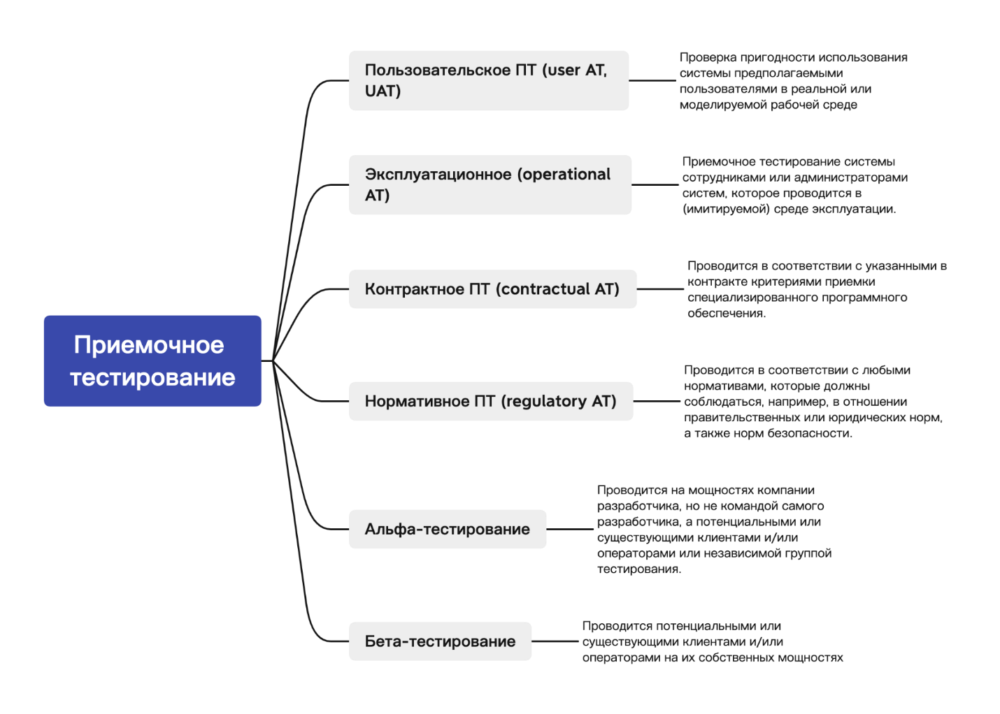

# Уровни тестирования

## Модульное (юнит, компонентное) тестирование
- **Unit/component/program/module testing** – тестируется минимально-атомарный модуль программы (функция, метод). Таких тестов должно быть больше всего.  
- **Компонентное тестирование (component testing)** – тестирование отдельных аппаратных/программных компонентов системы (*ISTQB Glossary*).  
- **Модульное тестирование (unit testing)** – тестирование изолированного элемента системы (метод, функция, класс) (*Библия QA*).  
- **Компонентное тестирование** – тестирование компонента отдельно, без интеграции (*Библия QA*).  

## Интеграционное тестирование
**Интеграционное тестирование (integration testing)** – тестирование взаимодействия между компонентами или системами.  

### Уровни интеграционного тестирования:
1. **Компонентный интеграционный уровень** – проверка взаимодействия компонентов одной системы.  
2. **Системный интеграционный уровень** – тестирование всей системы, состоящей из подсистем.  

### Подходы к интеграционному тестированию:
- **Большой взрыв (Big Bang Approach)** – все модули собираются вместе и тестируются сразу.  
- **Инкрементальный подход (Incremental Approach)** – модули объединяются поэтапно:  
  - **Нисходящий (Top-Down)** – тестируются высокоуровневые модули, низкоуровневые заменяются заглушками.  
  - **Восходящий (Bottom-Up)** – тестируются низкоуровневые модули, высокоуровневые заменяются драйверами.  
  - **Гибридный (Sandwich Approach)** – комбинация нисходящего и восходящего подходов.  

## Системное тестирование
**Системное тестирование (system testing)** – тестирование всей системы после интеграции (черный ящик).  

### Зачем нужно?
- Проверка работы системы в production-like среде.  
- Минимизация проблем после релиза.  
- Тестирование архитектуры и бизнес-требований.  

## Приемочное тестирование
**Приемочное тестирование (acceptance testing)** – проверка соответствия системы требованиям заказчика (end-to-end сценарии).  

## Позитивное, негативное и деструктивное тестирование
| Тип тестирования          | Описание                                                                 | Пример                                  |  
|---------------------------|--------------------------------------------------------------------------|-----------------------------------------|  
| **Позитивное**            | Проверка работы приложения в штатном режиме                              | Ввод валидных данных для регистрации    |  
| **Негативное**           | Проверка реакции на некорректные данные/действия                         | Ввод невалидных данных, ошибка          |  
| **Деструктивное**        | Намеренное нарушение работы приложения для нахождения точки отказа       | Нагрузка выше предела                   |  

### Правила тестирования:
1. Начинать с позитивных проверок.  
2. Не смешивать позитивные и негативные тесты (усложняет локализацию дефектов).  